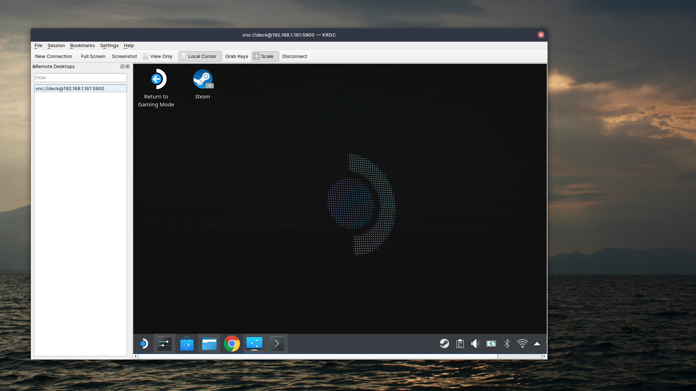
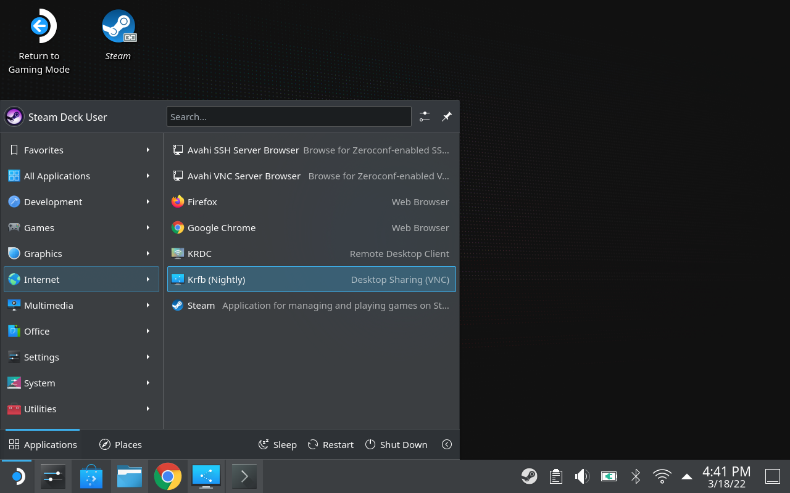
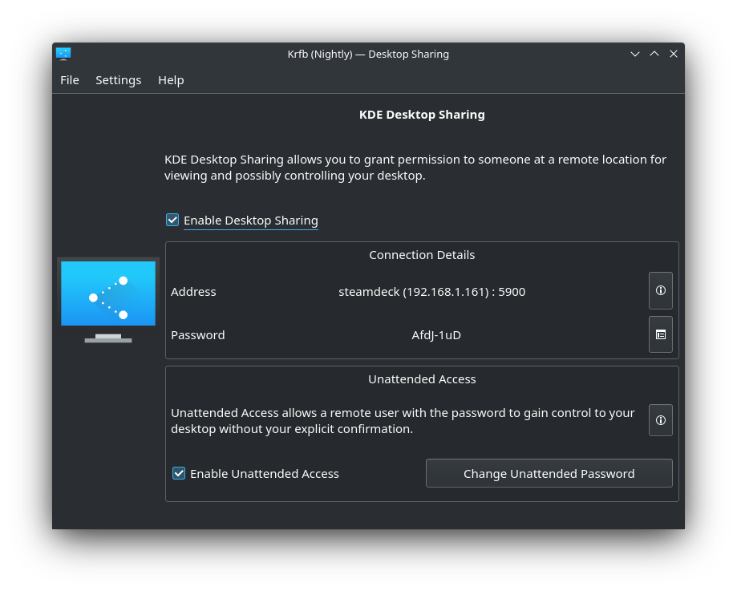
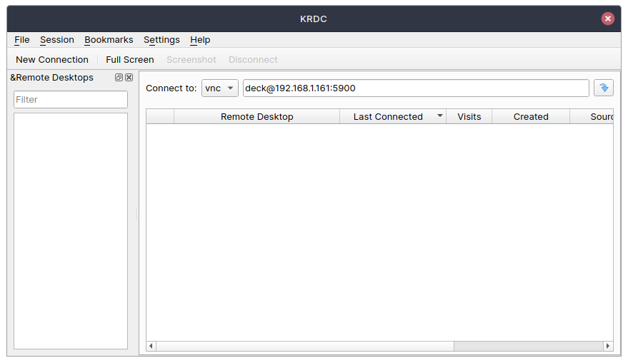
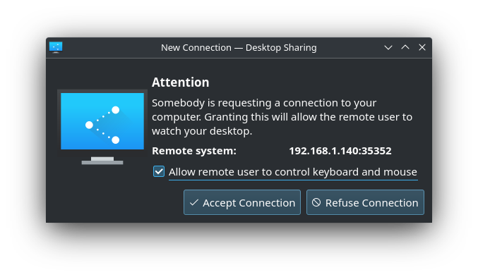

# Remote Desktop

Tweaking your Steam Deck in desktop mode is much easier with a keyboard and mouse. If you don't happen to have a USB-C dock to plug it in, you can use [Krfb](https://userbase.kde.org/Krfb) to share your desktop with your PC. Note that is is **not** performant enough to stream gameplay. 

This guide assumes you already ran `setup.sh` from this folder, or via the Deck-Buddy app.

## Steam Deck Setup

Once installed, launch Krfb. This can be easly done from the Application Launcher > Internet > Krfb

If everything was done correctly, you should see an IP Address other than 127.0.0.1 on the Connection Details box as seen bellow: 

## Desktop Setup

Install [Krdc](https://userbase.kde.org/Krdc) (or any VNC Client) on the machine you wish to access your Steam Deck from.

Launch the app. Select VNC from the `Connect to` dropdown, and type in `deck@YOUR_IP_ADDRESS:5900`, replacing "YOUR_IP_ADDRESS" with the IP shown on the image above. If you changed the username for desktop mode, replace `deck` with that username. 

Press the button to the right of this text box, and a dialog will pop up asking for the password. This is the password that is shown on the Connection Details on your Steam Deck. After setting the password, you will need to accept the connection on your Steam Deck. 

And that's it! Enjoy remote access to your Deck! 